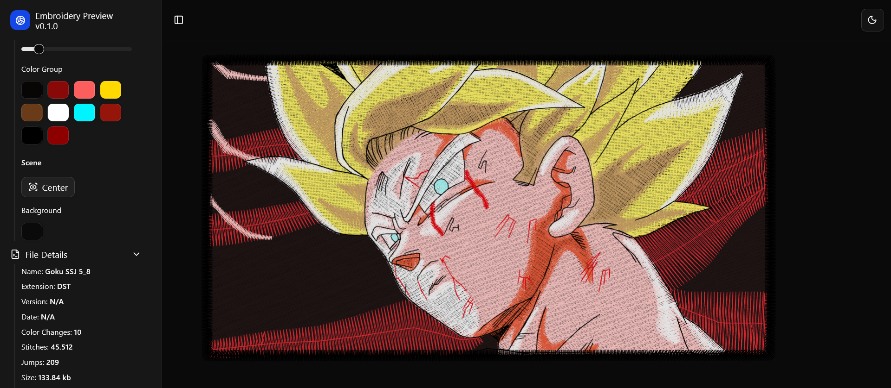

# Embroidery Preview

Interactive viewer for **embroidery files** using **React**, **Three.js**, and **Zustand**.

## Features

- **Load and visualize** embroidery files (DST, EXP, JEF, PES, and more planned).
- 3D rendering of stitches and color blocks.
- Supports multiple color groups as defined by the embroidery file (color stops).
- Control tools:
  - **Stitch Range**: Animate stitches sequentially.
  - **Color Group**: Edit colors for each color group/color-stop.
  - **Center**: Center the design in the viewport.
  - **Background**: Change the background color of the viewer.
- Automatic calculation of embroidery design width and height.
- Visual separation of blocks and machine jumps.
- Zustand-powered global state for fast and reactive UI.

## Screenshots



## Installation

```bash
git clone https://github.com/youruser/embroidery-preview.git
cd embroidery-preview
npm install
npm run dev
```

## Usage

1. **Upload an embroidery file** (DST, EXP, JEF, etc.) using the interface.
2. View the embroidery design in 3D.
3. Use the range and color controls to explore and customize the design.

## Main Structure

- `src/components/`
  - `EmbroideryViewer.tsx`: Renders the 3D canvas and all embroidery lines.
- `src/stores/`
  - `embroiderySource.store.ts`: Zustand store for embroidery data (geometries, color groups, file info).
  - `embroideryViewer.store.ts`: Zustand store for viewer state (camera, controls, UI).
- `src/types/`
  - `embroidery.types.ts`: Shared TypeScript types and interfaces for stitches, color groups, etc.
- `src/formats/`: Parsers for each embroidery format, generate geometries and color groups.

## Technical Notes

- Each stitch block is represented as an independent geometry for performance and clarity.
- Colors are assigned according to color changes (`color_stop`) defined in the embroidery file.
- The design's width and height are automatically calculated from the minimum and maximum stitch coordinates.
- The project is structured to easily add support for new embroidery formats.

## Future Implementations

- **Multi-format embroidery file reader:**  
  Support for additional formats such as PES, VP3, HUS, and more.
- **File conversion:**  
  Convert between embroidery formats, e.g. DST to EXP, PES to DST, etc.
- **Batch processing:**  
  Load and preview multiple embroidery files at once.
- **Export and download:**  
  Allow users to export or download converted embroidery files.
- **Advanced editing:**  
  Tools for editing stitches, colors, and sequence directly in the viewer.

## Credits

- [Three.js](https://threejs.org/)
- [React](https://react.dev/)
- [Zustand](https://zustand-demo.pmnd.rs/)
- [Shadcn/ui](https://ui.shadcn.com/docs/installation)
